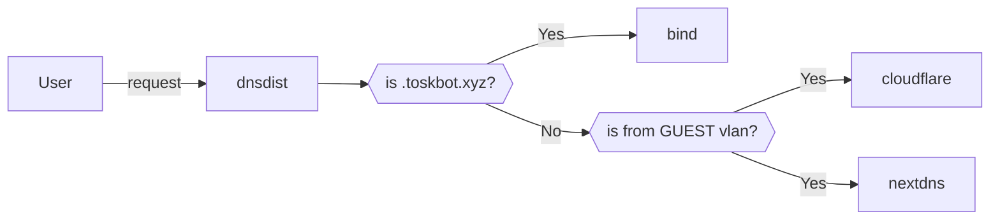

# VyOS Config

## Subnets

- 10.66.0.0/24 LAN
- 10.66.1.0/24 SERVERS
- 10.66.2.0/24 TRUSTED
- 10.66.3.0/24 IOT
- 192.168.50.0/24 GUEST

DHCP only hands out IPs from .200-.254

- 10.67.0.0/24 VYOS-CONTAINERS

## Containers

- Bind - 10.67.0.2
- dnsdist - 10.67.0.3
- HAProxy for K8s API - 10.67.0.4
  - load balances the k8s control plane nodes

## DNS

- dnsdist routes dns requests to different nameservers based on destination domain, source subnet, etc.
- bind acts as the main local nameserver where static entries and k8s-populated (external-dns) entries are added
- specific subnets can have dns resolved by nextdns using separate nextdns profiles
- guest network goes to cloudflare
