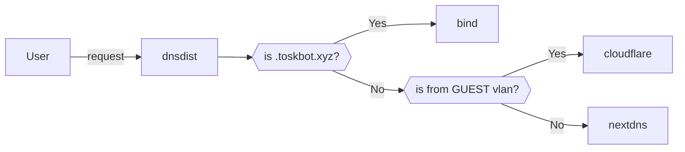

## My VyOS Router Configuration

## VLANs

| VLAN | Name       | Subnet          |
| :-:  | :-:        | :-:             |
| 0    | LAN        | 10.66.0.0/24    |
| 10   | SERVERS    | 10.66.1.0/24    |
| 20   | TRUSTED    | 10.66.2.0/24    |
| 30   | GUEST      | 192.168.50.0/24 |
| 40   | IOT        | 10.66.3.0/24    |
|      | WIREGUARD  | 10.66.5.0/24    |
|      | CONTAINERS | 10.67.0.0/24    |

!!! note
    DHCP will only hand out IPs from .200-.254

## Containers

| Name                       | Repo                                             | IP        |
| :-:                        | :-:                                              | :-:       |
| bind                       | docker.io/internetsystemsconsortium/bind9:9.19   | 10.67.0.2 |
| dnsdist                    | docker.io/powerdns/dnsdist-18:1.8.0              | 10.67.0.3 |
| haproxy (for k8s)          | docker.io/library/haproxy:2.7.8                  | 10.67.0.4 |
| unifi-controller           | ghcr.io/jacobalberty/unifi-docker:v7.5.174       | 10.67.0.5 |
| cloudflare-ddns            | docker.io/favonia/cloudflare-ddns:1.9.4          |           |
| udp-broadcast relay (mdns) | ghcr.io/onedr0p/udp-broadcast-relay-redux:1.0.27 |           |
| udp-broadcast relay (upnp) | ghcr.io/onedr0p/udp-broadcast-relay-redux:1.0.27 |           |

## DNS

DNS routing is handled by a [dnsdist](https://dnsdist.org/) container which splits traffic
for users on the local network to either: 

- an instance of [bind9](https://bind9.net/) for local services registered to my domain 
- a public DNS server for anything else

